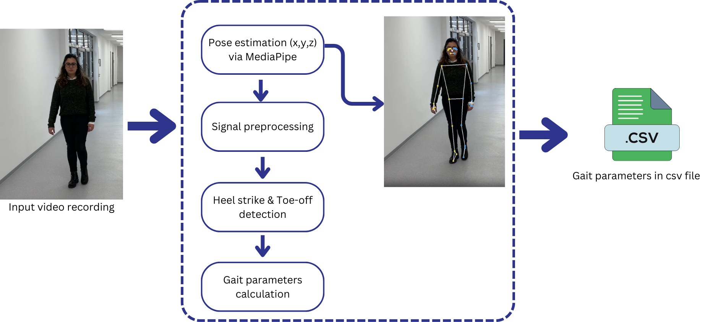

# Gait Parameters Module

This module computes spatiotemporal gait parameters from video recordings. The pipeline consists of four main steps: pose estimation, signal preprocessing, event detection (heel strike and toe-off), and gait parameter calculation. Each step is implemented as a separate script, and the entire pipeline can be run using `main.py`.

---

## **Pipeline Overview**


---

## **Steps in the Pipeline**

### **1. Pose Estimation**
- **Script**: `pose_estimation.py`
- **Input**: A video file in `.mp4` or `.mov` format.
- **Process**: Uses [MediaPipe](https://google.github.io/mediapipe/) for pose tracking to extract the `(x, y, z)` positions of body landmarks.
- **Output**: A `.csv` file containing pose data for each frame of the video.

---

### **2. Signal Preprocessing**
- **Script**: `preprocessing.py`
- **Input**: The pose data `.csv` generated in the previous step.
- **Process**:
  - **Empty cell interpolation**: Fills missing values in the pose data.
  - **Signal filtering**: Applies a median filter to smooth noisy data.
  - **Normalization**: Normalizes the pose data using the distance between the knee and the ankle as a reference.
- **Output**: Preprocessed pose data as a DataFrame.

---

### **3. Heel Strike and Toe-Off Detection**
- **Script**: `event_detection.py`
- **Input**: Preprocessed pose data `.csv`, algorithm type, and video frame rate.
- **Process**: Detects gait events:
  - **Heel strike (HS)**: The moment the heel touches the ground.
  - **Toe-off (TO)**: The moment the toe leaves the ground.
- **Algorithms Used**:
  1. **zeni**: Based on displacement. [Two simple methods for determining gait events during treadmill and overground walking using kinematic data](https://www.sciencedirect.com/science/article/pii/S0966636207001804?ref=pdf_download&fr=RR-2&rr=8fb9f8da1e91dc80)
  2. **dewitt**: Using acceleration and jerk. [Determination of toe-off event time during treadmill locomotion using kinematic data](https://www.sciencedirect.com/science/article/pii/S0021929010003908)
  3. **hreljac**: Combines acceleration and jerk. [Algorithms to determine event timing during normal walking using kinematic data](https://www.sciencedirect.com/science/article/pii/S0021929000000142)
- **Output**: A DataFrame of events with columns:
  - `HS_left`, `HS_right`: Heel strike events for left and right sides.
  - `TO_left`, `TO_right`: Toe-off events for left and right sides.

---

### **4. Gait Parameter Calculation**
- **Script**: `gait_params.py`
- **Input**: The events DataFrame from the previous step.
- **Process**: Calculates gait parameters based on the detected events.
- **Output**: A `.csv` file containing gait parameters for the left and right sides.

#### **Gait Parameters Table**
| **Parameter**         | **Description**                                      |
|------------------------|------------------------------------------------------|
| `Step Length`          | Distance between successive heel strikes of opposite feet. |
| `Stride Length`        | Distance between successive heel strikes of the same foot. |
| `Cadence`              | Number of steps taken per minute.                   |
| `Gait Speed`           | Walking speed, typically in meters per second.      |
| `Step Time`            | Time interval between two consecutive steps.        |
| `Double Support Time`  | Time both feet are in contact with the ground.       |

---

## **Running the Pipeline**
You can either:
1. **Run scripts independently**:
   ```bash
   python pose_estimation.py --input video.mp4 --output pose_data.csv
   python preprocessing.py --input pose_data.csv --output preprocessed_data.csv
   python event_detection.py --input preprocessed_data.csv --frame_rate 30 --zeni --output events.csv
   python gait_params.py --input events.csv --output gait_parameters.csv

2. **Run the entire pipeline**:
   - To process videos in a directory, run:
   ```bash
   python main.py --input_dir videos --config config.json --output_dir gait-kinematic-parameters
   ```

   - Alternatively, you can process a single video file:
   ```bash
   python main.py --input_path video.mp4 --config config.json --output_dir gait-kinematic-parameters
   ```

